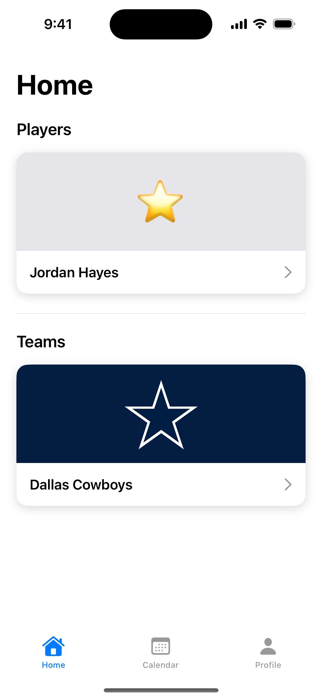
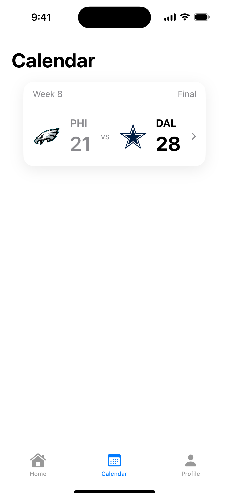
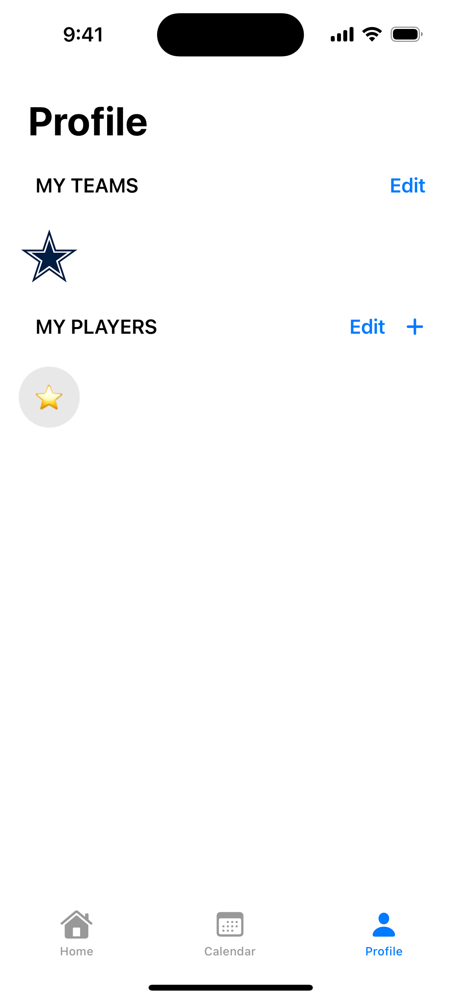
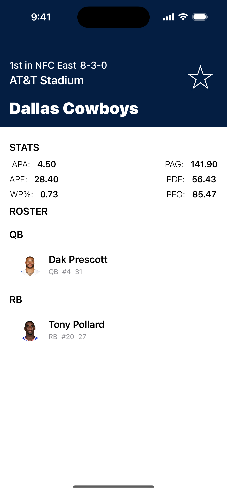
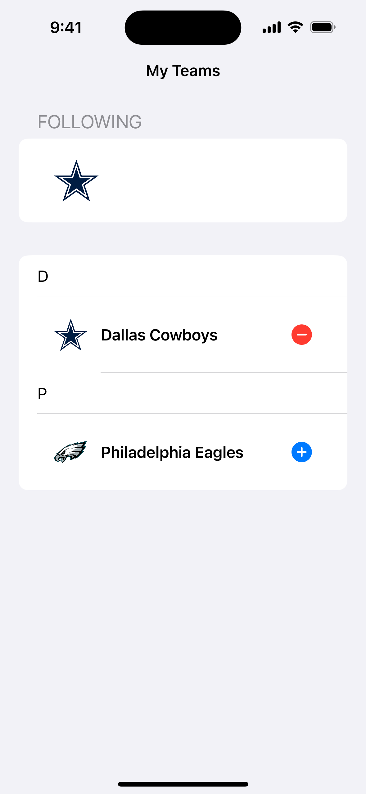

# NFL Now

Aplicacion iOS desarrollada con SwiftUI para consultar informacion de equipos, jugadores y estadisticas de la NFL desde una interfaz clara y modular.

## Descripcion

NFL Now permite:

- Crear y editar equipos seguidos
- Anadir jugadores personalizados
- Consultar estadisticas detalladas por jugador
- Visualizar rendimientos individuales y colectivos
- Revisar resumenes de partido y puntuaciones por cuarto
- Mantener datos guardados en local con `UserDefaults`

La app esta construida completamente en SwiftUI y sigue una organizacion modular para facilitar mantenimiento y crecimiento.

## Arquitectura

El proyecto sigue el patron MVVM (`Model-View-ViewModel`) con una separacion clara entre presentacion, logica de negocio y modelos de datos.

```text
core/       storage/ | errors/ | constants/ | screenshot/
view/       Calendar/ | Home/ | Profile/ | ViewTeam/ | ViewGameSummary/ | ViewPlayer/ | SharedComponents/
viewmodel/  TeamStore | PlayerStore | GameSummaryViewModel | TeamViewModel | RosterViewModel | ScoreBoardViewModel
services/   NFLService | APIError
model/      CreatedPlayer | PlayerListItem | TopPerformances | PlayerStats | ScoreBoard | GameSummary | Team | Roster
```

## Persistencia local

La persistencia se implementa con `UserDefaults` a traves de `DefaultStorage`, una capa dedicada que evita acoplar vistas y view models al almacenamiento.

Incluye:

- Guardado de equipos seguidos
- Guardado de jugadores creados por el usuario
- Serializacion segura con `Codable`, `JSONEncoder` y `JSONDecoder`

## Regla de negocio destacada

`TeamStore` gestiona el estado de los equipos seguidos y aplica un limite maximo de 5 equipos simultaneos.

## Capturas del simulador

<table>
  <tr>
    <td align="center">
      
      <br /><sub>Home</sub>
    </td>
    <td align="center">
      
      <br /><sub>Calendar</sub>
    </td>
    <td align="center">
      
      <br /><sub>Profile</sub>
    </td>
  </tr>
  <tr>
    <td align="center">
      
      <br /><sub>Team info</sub>
    </td>
    <td align="center">
      
      <br /><sub>Add team</sub>
    </td>
    <td></td>
  </tr>
</table>

## Recursos adicionales

[Recursos Usados - NFLNow.pdf](https://github.com/user-attachments/files/25337196/Recursos.Usados.-.NFLNow.pdf)
